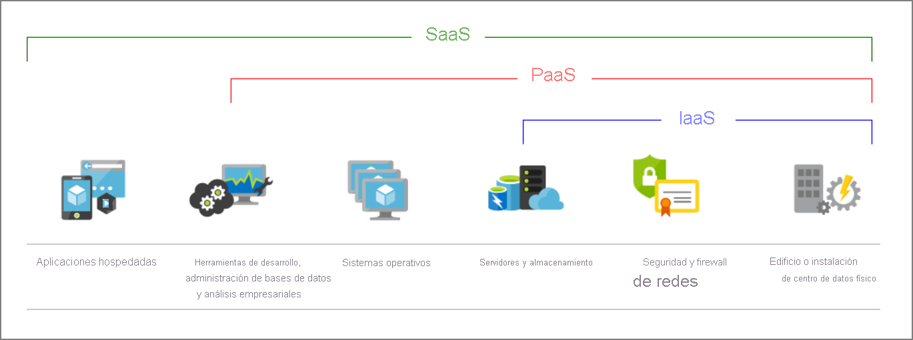

# CONCEPTOS DEL CURSO AZURE   :notebook:

## Introducción a los aspectos básicos de Azure
Azure es una plataforma de informática en la nube con un conjunto de servicios que se amplía continuamente para ayudarle a crear soluciones que satisfagan los objetivos empresariales. Los servicios de Azure van desde servicios web sencillos para hospedar la presencia empresarial en la nube hasta la ejecución de equipos totalmente virtualizados para ejecutar soluciones de software personalizadas. Azure proporciona una gran cantidad de servicios basados en la nube, como el almacenamiento remoto, el hospedaje de bases de datos y la administración centralizada de cuentas. También ofrece nuevas funcionalidades, como inteligencia artificial e Internet de las cosas (IoT).

### ¿Qué es la informática en la nube? 
Es la entrega de servicios informáticos a través de Internet, lo que se conoce como la nube. Estos servicios incluyen servidores, almacenamiento, bases de datos, redes, software, análisis e inteligencia. La informática en la nube ofrece una innovación más rápida, recursos flexibles y economías de escala.

### ¿Qué es la informática sin servidor?
La informática sin servidor permite que los desarrolladores creen aplicaciones más rápidamente, ya que elimina la necesidad de administrar la infraestructura.
El término "sin servidor" procede del hecho de que las tareas asociadas a la administración y el aprovisionamiento de la infraestructura son invisibles para el desarrollador. Este enfoque permite a los desarrolladores centrar su atención en la lógica de negocios y ofrecer más valor al núcleo de la empresa. La informática sin servidor ayuda a los equipos a aumentar su productividad y a llevar los productos al mercado con más rapidez, y permite a las organizaciones optimizar mejor los recursos y seguir centrándose en la innovación.

## Conceptos fundamentales de Azure
### Ventajas de la informática en la nube
#### **Alta disponibilidad**
En función del contrato de nivel de servicio (SLA) que elija, las aplicaciones basadas en la nube pueden proporcionar una experiencia de usuario continua sin tiempo de inactividad perceptible, aunque se produzcan errores.

#### **Escalabilidad**
Las aplicaciones en la nube se pueden escalar verticalmente y horizontalmente:
- El escalado vertical se usa para aumentar la capacidad de proceso mediante la incorporación de RAM o CPU adicionales a una máquina virtual.
- El escalado horizontal aumenta la capacidad de proceso mediante la adición de instancias de recursos, como la incorporación de máquinas virtuales a la configuración.

#### **Elasticidad**
Puede configurar aplicaciones basadas en la nube para aprovechar el escalado automático, de forma que las aplicaciones siempre dispondrán de los recursos que necesitan.

#### **Agilidad**
Implemente y configure rápidamente los recursos basados en la nube a medida que cambian los requisitos de la aplicación.

#### **Distribución geográfica**
Puede implementar aplicaciones y datos en centros de datos regionales de todo el mundo, lo que garantiza que sus clientes siempre tendrán el mejor rendimiento de su región.

#### **Recuperación ante desastres**
Al usar los servicios de copia de seguridad basados en la nube, la replicación de datos y la distribución geográfica, podrá implementar las aplicaciones con la seguridad de saber que los datos están protegidos en caso de que se produzca un desastre.

### Gastos  :dollar:
#### **Gastos de capital (CapEx)**
Los gastos de capital (CapEx) hacen referencia a la inversión previa de dinero en infraestructura física, que se podrá deducir a lo largo del tiempo. El costo previo de CapEx tiene un valor que disminuye con el tiempo.
#### **Gastos operativos (OpEx)**
Los gastos operativos (OpEx) son dinero que se invierte en servicios o productos y se factura al instante. Este gasto se puede deducir el mismo año que se produce. No hay ningún costo previo, ya que se paga por un servicio o producto a medida que se usa.

### Modelos de servicios a la nube
Existen tres diferentes modelos de servicio en la nube, IaaS, PaaS, SaaS. Estos modelos definen los direfentes niveles de responsabilidad compartida de un proveedor de nube y un inquilino de nube.
#### **IaaS**
Infraestructura como servicio o también llamada IaaS, es un modelo de servicio en la nube es el más similar a la administración de servidores físicos; un proveedor de servicios en la nube mantendrá actualizado el hardware, pero el mantenimiento del sistema operativo y la configuración de red serán su responsabilidad como inquilino de nube. 
#### **PaaS**
Plataforma como servicio o su acrónimo PaaS, este modelo de servicio en la nube es un entorno de hospedaje administrado. El proveedor de servicios en la nube administra las máquinas virtuales y los recursos de red, y el inquilino de nube implementa sus aplicaciones en el entorno de hospedaje administrado. 
#### **SaaS**
Software como servicio o SaaS, es un modelo de servicio en la nube, el proveedor de servicios en la nube administra todos los aspectos del entorno de la aplicación, como las máquinas virtuales, los recursos de red, el almacenamiento de datos y las aplicaciones. El inquilino de nube solo necesita proporcionar sus datos a la aplicación administrada por el proveedor de servicios en la nube.

En la siguiente ilustración se muestran los servicios que pueden ejecutarse en cada uno de los modelos de servicios en la nube.

### Tipos de informática en la nube :cloud:
Hay tres modelos de implementación para la informática en la nube: nube pública, nube privada y nube híbrida. Cada modelo de implementación tiene distintos aspectos que debe tener en cuenta a la hora de migrar a la nube.
#### **Nube pública**
Los servicios se ofrecen a través de la red Internet pública y están disponibles para cualquiera que quiera comprarlos. Los recursos de nube, como los servidores y el almacenamiento, son propiedad de un proveedor de servicios en la nube de terceros, que los explota y los distribuye a través de Internet.
#### **Nube privada**
Una nube privada consta de recursos informáticos que determinados usuarios de una empresa u organización usan en exclusiva. Una nube privada puede estar ubicada físicamente en el centro de datos local (entorno local) de la organización o estar hospedada por un proveedor de servicios de terceros.
#### **Nube híbrida**
Una nube híbrida es un entorno informático que combina una nube pública y una nube privada, lo que permite compartir datos y aplicaciones entre ellas.

